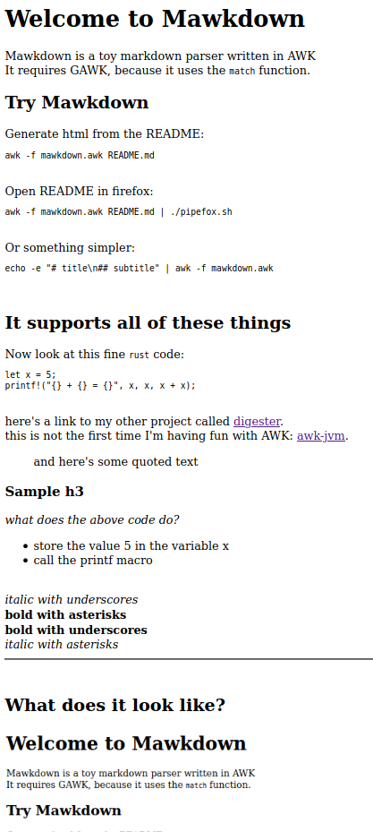

# Welcome to Mawkdown
Mawkdown is a toy markdown parser written in AWK

It requires GAWK, because it uses the `match` function.

## Try Mawkdown
Generate html from the README:
```bash
awk -f mawkdown.awk README.md
```

Open README in firefox:
```bash
awk -f mawkdown.awk README.md | ./pipefox.sh
```

Or something simpler:
```bash
echo -e "# title\n## subtitle" | awk -f mawkdown.awk
```

## It supports all of these things
Now look at this fine `rust` code:

```
let x = 5;
printf!("{} + {} = {}", x, x, x + x);
```

here's a link to my other project called [digester](https://digester.app?ref=mawkdown).

this is not the first time I'm having fun with AWK: [awk-jvm](https://github.com/rethab/awk-jvm).

> and here's some quoted text

### Sample h3
*what does the above code do?*
- store the value 5 in the variable x
- call the printf macro

_italic with underscores_

**bold with asterisks**

__bold with underscores__

*italic with asterisks*

---

## What does it look like?
  
(note that pipefox does not work with relative images)

## Limitations
*basically any line can only contain one thing*

- formatting *within* a list does not work
- langauge-specific formatting
